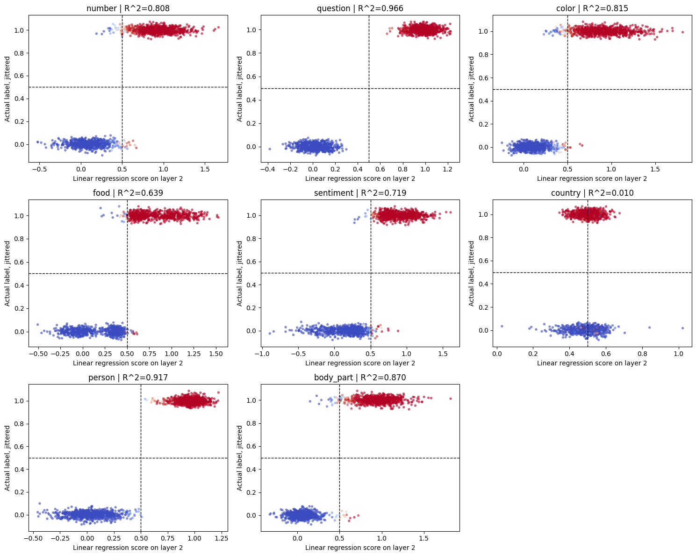
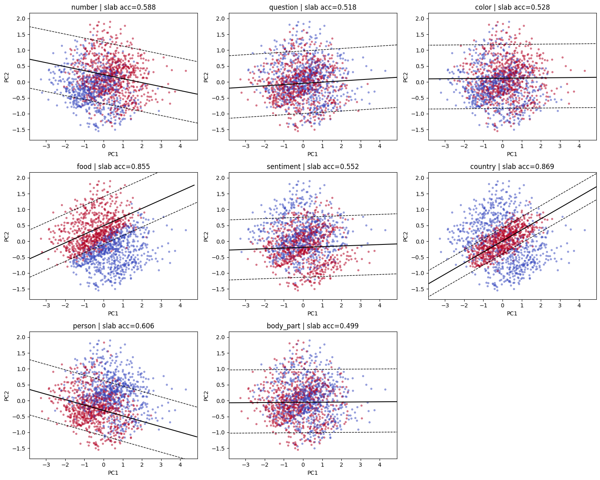
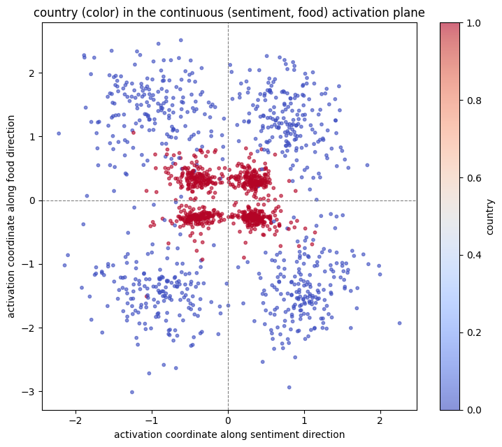
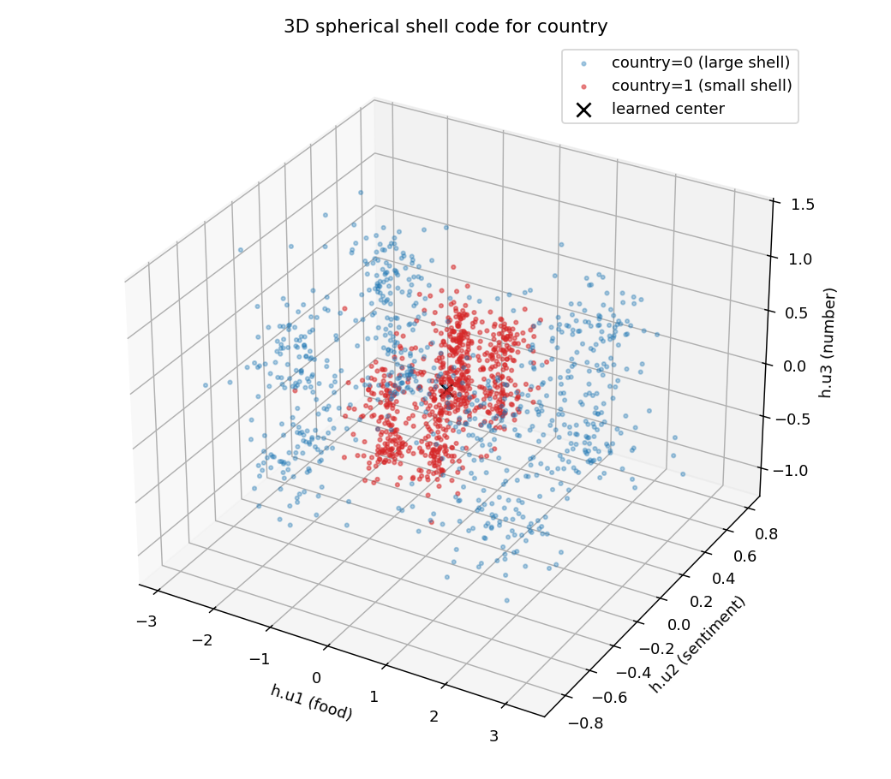

# BlueDot TAIS Puzzle #1 — write-up

My submission for [BlueDot's Technical AI Safety Puzzle #1](https://bluedot.org/puzzles/technical-ai-safety)
([puzzle repo](https://github.com/SamDower/bluedot-tais-puzzle)): find the feature the puzzle model does
not represent linearly at layer 2, explain the geometry it uses instead, and train a model with a stranger
representation still. The text below is the submitted write-up; the code that produced it is in this repo.

## Introduction

The following is a description of the process undertaken to solve the ‘Technical AI Safety puzzle” by Bluedot. Which can be found at the following [link](https://bluedot.org/puzzles/technical-ai-safety).

The code used in the project was mostly generated by LLMs. Chatbots were also used to discuss ideas and interpretations. Final analysis decisions and write up were done with minimal AI assistance (spell check, consistency checks, etc.).

## The non-linear feature

To find the feature that is not linearly represented at the activation layer, a linear model was fit with the activation layer as input and the feature as target variable. A separate model was fit for each feature. The feature predictions of the model itself were used as y, as well as the actual features in the train/test data, in order to test representation of both the models predictions as well as the actual data. A logistic regression model as well as an OLS regression model was fit for each feature. Metrics were obtained for each model. The results clearly suggested that feature 5 (Country) was non linear with regards to activations after layer 2. Metrics and plots can be found below.



*Figure 1: on the X axis a linear probe score of the activation layers. On y axis the feature labels of the feature (slightly jittered to prevent overlap).*

|**Feature**|**Logistic Model accuracy**|**OLS R2**|**MSE**|
|---|---|---|---|
|Number|0.9733|0.81|0.048|
|Question|1|0.97|0.008|
|Color|0.9787|0.82|0.046|
|Food|0.9867|0.64|0.090|
|Sentiment|0.9867|0.72|0.070|
|Country|0.5413|0.01|0.247|
|Person|0.9947|0.92|0.020|
|Body part|0.9722|0.87|0.032|

A quick sanity check was done to make sure there was some sort of other relation between the activation layer and the ‘Country’ feature. An MLP was trained, which showed a massive increase in performance measured in AUC compared to the linear model. Also, the accuracy of the model itself was tested (to test if the ‘country’ feature actually is predicted well by the model), and every feature was predicted relatively well in the test set. For mapping the activation layer 2 to the ‘country’ feature, the MLP fulfills a similar role to the final layer of the original model.

## How ‘Country’ is represented

So if ‘country’ can not be described by a linear relation, how can it be described? First, I tried to decompose the 64 dimensions of the activation layer to 2 using PCA as well as UMAP, hoping to get a visual intuition of how features were represented. The results for UMAP were messy and not interpretable, but the PCA showed two clear clusters (see figure 2). This region could be reasonably well defined along a diagonal, which led to the first interpretation: there exist some two dimensions in which an area exists that clearly defines the boundary between country=0 and country=1.

The explanation though, was unsatisfactory, as the diagonal along the 2 axes of the PCA dimensions are hard to interpret. To look for more relations, a sweep was done to look for interaction between the non linear feature and all other output features. Specifically, it was investigated whether the country feature could be described as any AND/OR/XOR combination of other feature pairs. This turned out not to be the case, the highest accuracy achieved after checking all combinations was approximately .54.



*Figure 2: PCA decomposition with middle and boundaries fitted to match feature distribution.*

To further look into relations between target features: Linear models were fitted with the ‘Country’ feature as target, but X was split into 2 sets based on the distribution of every other feature. The accuracy of that linear model was compared to the baseline accuracy of the total set. Two features (‘food’ and ‘sentiment’, henceforth A and B) showed a clear relation; By conditioning on A and B, models predicting ‘country’ had AUC scores between 0.92 and 0.96.

Various interactions were subsequently explored between the ‘country’ feature and A and B.

First, the correlation between [A] and [B] was researched, as the relation was so similar and they had shown similar accuracy scores in the model as well. They did not turn out to be correlated (-.02).

Second we needed to find out if the direction along which A and B influenced ‘Country’ was similar. By measuring the cosine of the direction, we found different directions in which A and B influenced the ‘country’ variable.

To get more insight into the relation between these three features, a plot was made with the layer2 activations of A and B on the X,Y axes and the country color coded. This clearly showed that positive points were centered around the origin (see figure 3). A simple fit was tested where the main predictor was distance to origin in A,B space. For the AUC between the negative distance r = √(x²+y²) and ‘country’, a score of 0.993 was computed.



*Figure 3: Layer-2 activations projected onto the food (Y) and sentiment (X) probe directions, colored by country*

This led to the final conclusion: Country is encoded as a disc (or rather four lobes in four quadrant corners) around the origin of the food/sentiment space. The conditional improvements dependent on food and sentiment respectively are consequences of this fact.

## Training more complex relations

To see if more complex relations can be trained into a model. We attempt to do the same thing, but with 3 conditional features instead of 2. Instead of attempting to make a 2d disc-like shape around the origin of two feature probe directions, we train the model so that the country feature will be represented as a 3d sphere-like shape around a learnable center in a 3d space of 3 feature probe directions. We will attempt to do this by adding some additional requirements to the loss function. Instead of just training the model to do its job, we add additional requirements. The loss function was written with the following components:

- The model should work, measured as log loss between feature predictions and actuals
- The features at layer 2 should be linear again (ie a direction probe should mean something similar to the original model, h(i)\*a(2) can predict feature i at layer 2 again).
- Radius MSE for the country feature in the 3d space along probes for the features food, sentiment and number. (smaller radius means country = positive)
- Linear adversary loss for ‘country’ so that it doesn't leak into other dimensions.

Each of these losses was scaled by a parameter and those parameters were initialized to make the terms comparable in magnitude, then adjusted based on which criteria failed.

- **Min output AUC ≥ 0.95** (all 8 features), the model should do its job
- **Min AUC for linear probe at layer 2 ≥ 0.95** (all features apart from country)
- **Linear probe for country at layer 2 ≤ 0.65**
- **Triple-conditioned AUC ≥ 0.9**
- **Centered-radius score ≥ 0.97**

Loss parameters were not so much optimized but intuitively updated based on which criteria were or were not satisfied after a training run. The model architecture was kept the same.



*Figure 4: the same principle as figure 3, but now in 3D.*

Figure 4 describes the final outcome of one of the models constructed. All criteria were satisfied (see table below).

|**Criterion**|**Value**|
|---|---|
|1. min output AUC (8 features)|0.9845|
|min non-country linear probe (h)|0.9923|
|marginal linear probe (country)|0.5236|
|Mean octant-conditioned AUC|0.9753|
|-r ranking AUC (centered)|0.9919|

## Conclusion

Analysis was done in order to find the non-linear feature with regard to the second activation layer in a pretrained neural net. It was found to be the ‘country’ feature. Instead, the relation could be described as dependent on two other output features. ‘Country’ turned out to be encoded around the origin of the ‘food’ vs ‘sentiment’ activation space.

A model was subsequently trained attempting to do the same in 3d. Adding the ‘number’ output feature and attempting to encode ‘Country’ around a learnable center in the 3d space. This turned out to be possible.

## What's in this repo

| file | what it is |
|---|---|
| `BlueDot.ipynb` | the analysis behind “the non-linear feature” and “how ‘Country’ is represented”: probe battery, PCA/UMAP views, boolean-combination sweep, conditioned probes, the food/sentiment plane and radius test, causal steering |
| `analyze.py` | first pass at the puzzle model as a plain script |
| `sphere_model.py` | model definition + data/embedding utilities for the 3D spherical code |
| `train_sphere.py` | first task-3 training run (`sphere_model.pt`) |
| `train_sphere_v2.py` | the training run that produced the reported model (`sphere_model_v2b.pt`) |
| `analyze_sphere.py`, `analyze_sphere_v2.py` | probe-ladder evaluation + diagnostic plots for a trained sphere model |
| `sphere_model_v2b.pt` | the task-3 checkpoint the final table refers to |
| `model.pt`, `feature_names.json`, `model_architecture.png`, `puzzle.ipynb` | unmodified files from the upstream puzzle repo |
| `figures/` | the write-up's figures |

Training logs, intermediate checkpoints, generated plots and probe-ladder dumps are regenerable and are
not tracked — see `.gitignore`.

## The model being analysed

`sentence-transformers/all-MiniLM-L6-v2` (mean-pooled, 384-d) followed by a 5-layer MLP head with ReLUs
and 8 sigmoid outputs — `number`, `question`, `color`, `food`, `sentiment`, `country`, `person`,
`body_part`. "Layer 2" throughout means the post-ReLU activation of hidden layer 2,
`h = m.layers[:6](embeddings)`, in R^64.


## Reproducing

The puzzle's dataset is not included here. Fetch `data/train.jsonl` and `data/test.jsonl` from the
upstream repo:

```bash
git clone https://github.com/SamDower/bluedot-tais-puzzle.git /tmp/puzzle
cp -r /tmp/puzzle/data .
```

Then:

```bash
python -m venv .venv && source .venv/bin/activate
pip install -r requirements.txt

# the analysis of the puzzle model
jupyter lab BlueDot.ipynb

# "training more complex relations": evaluate the shipped checkpoint (writes plots + a probe-ladder table)
python analyze_sphere_v2.py sphere_model_v2b.pt

# "training more complex relations": retrain from scratch (150 epochs; the first run embeds the dataset and caches it)
python train_sphere_v2.py
```

The first run downloads the MiniLM encoder from Hugging Face and caches sentence embeddings under
`cache/`. Training is CPU-friendly: the head is tiny and the encoder runs once per split.

## Credits

The puzzle, `model.pt`, the dataset and the starter notebook are BlueDot Impact's, from
[SamDower/bluedot-tais-puzzle](https://github.com/SamDower/bluedot-tais-puzzle). Everything else here is
my own analysis and training code.
